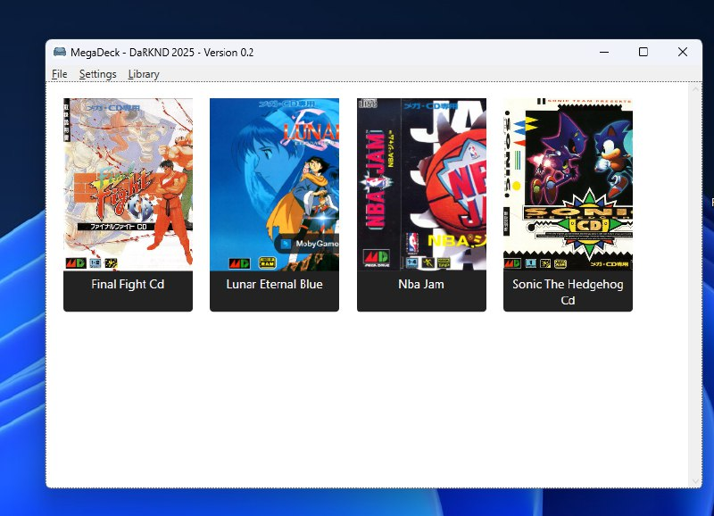

# 🎮 MegaDeck

MegaDeck is a modern ROM launcher inspired by DuckStation, made for managing and launching MegaCD/Sega CD games via RetroArch.

## 📥 Download

👉 [Download the latest release](https://github.com/darknd/MegaDeck/releases/latest)

## 💾 Features

- Custom cover support
- ROM folder browser
- RetroArch integration
