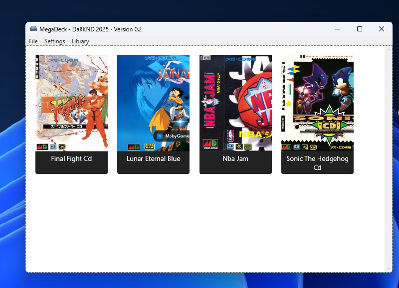
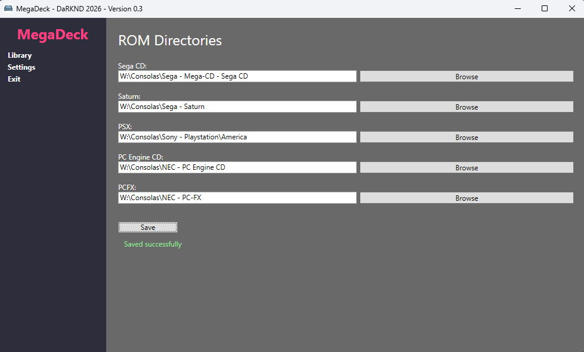

# 🎮 MegaDeck

MegaDeck is a modern ROM launcher inspired by DuckStation, made for managing and launching Sega CD/Saturn/PC Engine CD/PCFX games (by now) via RetroArch.




---

## 📥 Download

👉 [Download the latest release](https://github.com/darknd/MegaDeck/releases/latest)

---

## 💾 Features

- Windows 95 style interface (Large Icons / Details views, classic dialogs)
- Custom cover support
- ROM folder browser
- `.cue`, `.chd` and `.zip` games (zipped games are extracted to `cache/` before launching)
- RetroArch integration (included with the necessary bios files)

---

## 🛠️ Built With

- **.NET 8**
- **Avalonia UI (XAML + C#)**, runs on Windows and Linux
- **RetroArch** as the emulator backend (bundled for both platforms)
- Custom JSON-based config and cover caching

---

## 📦 Requirements

- ✅ Windows 10 or 11 (x64), or Linux (x64)
- ✅ .NET 8 Runtime  
  If using the **framework-dependent build**, download it here:  
  [Download .NET 8 Runtime](https://dotnet.microsoft.com/en-us/download/dotnet/8.0/runtime)
- ✅ RetroArch and SegaCD/Saturn/PSX/PCE_CD/PCFX cores included in `/engine/` (Windows) and `/engine-linux/` (Linux)

> 💡 You can use a **self-contained build** that doesn't require installing .NET (see the Releases section).

---

## ⚙️ Setup

1. Download the latest release
2. Extract the ZIP
3. Run `MegaDeck.exe` (Windows) or `./MegaDeck` (Linux)
4. In **Settings**, set your ROMs directory
5. Double-click any game to launch via RetroArch

---

## 🔨 Building

```bash
dotnet publish MegaDeck/MegaDeck.csproj -c Release -r win-x64 --self-contained true -o publish/win-x64
dotnet publish MegaDeck/MegaDeck.csproj -c Release -r linux-x64 --self-contained true -o publish/linux-x64
```
